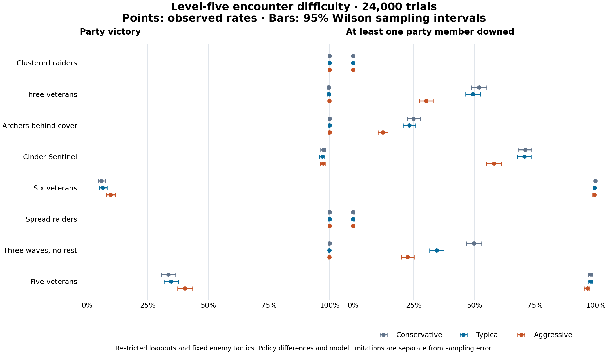

# Level-five encounter stress test

Fixed design: **1000 trials per encounter/policy**, master seed **20261002**. 24 groups. Source fingerprint: `053a434a173838bd6b9629b79e9c8a49e8ad1b4ef2dfec2a2b3a6cf061034dab`.

Four combat archetypes: Mara (fighter, HP49/AC18), Kestrel (rogue, HP38/AC16), Iona (cleric, HP38/AC18), Orrin (wizard, HP32/AC12). These are explicitly bounded subclass-neutral loadouts, not complete character sheets. See [mechanics and assumptions](../../../docs/level_five_benchmark.md).

## Encounter outcomes

Every percentage includes its two-sided 95% Wilson interval. All trials stay in the denominator, including censored trials. The three policies differ in willingness to spend resources; enemies use the same aggressive policy throughout.

| Encounter | Policy | Win % [95% CI] | Any down % [95% CI] | Any death % [95% CI] | Mean rounds | Median HP left |
|---|---|---:|---:|---:|---:|---:|
| 01_raider_patrol | conservative | 100.0% [99.6, 100.0] | 0.0% [0.0, 0.4] | 0.0% [0.0, 0.4] | 2.4 | 153/157 |
| 01_raider_patrol | typical | 100.0% [99.6, 100.0] | 0.0% [0.0, 0.4] | 0.0% [0.0, 0.4] | 2.2 | 155/157 |
| 01_raider_patrol | aggressive | 100.0% [99.6, 100.0] | 0.0% [0.0, 0.4] | 0.0% [0.0, 0.4] | 2.2 | 157/157 |
| 02_veteran_line | conservative | 99.6% [99.0, 99.8] | 51.9% [48.8, 55.0] | 2.0% [1.3, 3.1] | 5.4 | 118/157 |
| 02_veteran_line | typical | 99.7% [99.1, 99.9] | 49.4% [46.3, 52.5] | 0.9% [0.5, 1.7] | 5.3 | 123/157 |
| 02_veteran_line | aggressive | 99.9% [99.4, 100.0] | 30.1% [27.3, 33.0] | 0.6% [0.3, 1.3] | 4.8 | 135/157 |
| 03_archer_cover | conservative | 100.0% [99.6, 100.0] | 24.9% [22.3, 27.7] | 0.0% [0.0, 0.4] | 3.8 | 144/157 |
| 03_archer_cover | typical | 100.0% [99.6, 100.0] | 23.1% [20.6, 25.8] | 0.0% [0.0, 0.4] | 3.8 | 146/157 |
| 03_archer_cover | aggressive | 100.0% [99.6, 100.0] | 12.2% [10.3, 14.4] | 0.0% [0.0, 0.4] | 3.6 | 156/157 |
| 04_cinder_sentinel | conservative | 97.4% [96.2, 98.2] | 70.9% [68.0, 73.6] | 3.5% [2.5, 4.8] | 8.6 | 81/157 |
| 04_cinder_sentinel | typical | 97.0% [95.7, 97.9] | 70.6% [67.7, 73.3] | 3.2% [2.3, 4.5] | 8.5 | 101/157 |
| 04_cinder_sentinel | aggressive | 97.3% [96.1, 98.1] | 58.0% [54.9, 61.0] | 2.1% [1.4, 3.2] | 7.8 | 113/157 |
| 05_overwhelming_line | conservative | 5.9% [4.6, 7.5] | 99.8% [99.3, 99.9] | 13.8% [11.8, 16.1] | 6.6 | 0/157 |
| 05_overwhelming_line | typical | 6.5% [5.1, 8.2] | 99.6% [99.0, 99.8] | 14.8% [12.7, 17.1] | 6.6 | 0/157 |
| 05_overwhelming_line | aggressive | 9.7% [8.0, 11.7] | 99.4% [98.7, 99.7] | 15.5% [13.4, 17.9] | 7.2 | 0/157 |
| 06_spread_patrol | conservative | 100.0% [99.6, 100.0] | 0.0% [0.0, 0.4] | 0.0% [0.0, 0.4] | 3.5 | 151/157 |
| 06_spread_patrol | typical | 100.0% [99.6, 100.0] | 0.0% [0.0, 0.4] | 0.0% [0.0, 0.4] | 3.1 | 154/157 |
| 06_spread_patrol | aggressive | 100.0% [99.6, 100.0] | 0.0% [0.0, 0.4] | 0.0% [0.0, 0.4] | 3.0 | 157/157 |
| 07_attrition | conservative | 100.0% [99.6, 100.0] | 49.8% [46.7, 52.9] | 0.4% [0.2, 1.0] | 10.0 | 120/157 |
| 07_attrition | typical | 99.9% [99.4, 100.0] | 34.4% [31.5, 37.4] | 0.4% [0.2, 1.0] | 9.8 | 135/157 |
| 07_attrition | aggressive | 99.9% [99.4, 100.0] | 22.4% [19.9, 25.1] | 0.6% [0.3, 1.3] | 9.3 | 138/157 |
| 08_five_veterans | conservative | 33.5% [30.6, 36.5] | 98.0% [96.9, 98.7] | 21.9% [19.4, 24.6] | 8.4 | 0/157 |
| 08_five_veterans | typical | 34.7% [31.8, 37.7] | 97.9% [96.8, 98.6] | 18.0% [15.7, 20.5] | 8.5 | 0/157 |
| 08_five_veterans | aggressive | 40.4% [37.4, 43.5] | 96.5% [95.2, 97.5] | 21.0% [18.6, 23.6] | 8.6 | 0/157 |

## Policy sensitivity

This spread is a sensitivity analysis, not another confidence interval. It excludes differences between these bots and actual human players.

| Encounter | Win-rate range across tested policies | Largest win CI half-width |
|---|---:|---:|
| 01_raider_patrol | 100.0–100.0% | ±0.2 pp |
| 02_veteran_line | 99.6–99.9% | ±0.4 pp |
| 03_archer_cover | 100.0–100.0% | ±0.2 pp |
| 04_cinder_sentinel | 97.0–97.4% | ±1.1 pp |
| 05_overwhelming_line | 5.9–9.7% | ±1.8 pp |
| 06_spread_patrol | 100.0–100.0% | ±0.2 pp |
| 07_attrition | 99.9–100.0% | ±0.3 pp |
| 08_five_veterans | 33.5–40.4% | ±3.0 pp |

## Defeat, death, and unresolved fights

Defeat means all party members are unconscious or dead. **All dead at stop** counts only confirmed deaths at termination; it is not eventual TPK probability. The model stops at defeat and does not simulate executions, capture, or later recovery.

| Encounter / policy | Defeat % [95% CI] | All dead at stop % [95% CI] | Censored % [95% CI] |
|---|---:|---:|---:|
| 01_raider_patrol / conservative | 0.0% [0.0, 0.4] | 0.0% [0.0, 0.4] | 0.0% [0.0, 0.4] |
| 01_raider_patrol / typical | 0.0% [0.0, 0.4] | 0.0% [0.0, 0.4] | 0.0% [0.0, 0.4] |
| 01_raider_patrol / aggressive | 0.0% [0.0, 0.4] | 0.0% [0.0, 0.4] | 0.0% [0.0, 0.4] |
| 02_veteran_line / conservative | 0.4% [0.2, 1.0] | 0.0% [0.0, 0.4] | 0.0% [0.0, 0.4] |
| 02_veteran_line / typical | 0.3% [0.1, 0.9] | 0.0% [0.0, 0.4] | 0.0% [0.0, 0.4] |
| 02_veteran_line / aggressive | 0.1% [0.0, 0.6] | 0.0% [0.0, 0.4] | 0.0% [0.0, 0.4] |
| 03_archer_cover / conservative | 0.0% [0.0, 0.4] | 0.0% [0.0, 0.4] | 0.0% [0.0, 0.4] |
| 03_archer_cover / typical | 0.0% [0.0, 0.4] | 0.0% [0.0, 0.4] | 0.0% [0.0, 0.4] |
| 03_archer_cover / aggressive | 0.0% [0.0, 0.4] | 0.0% [0.0, 0.4] | 0.0% [0.0, 0.4] |
| 04_cinder_sentinel / conservative | 2.6% [1.8, 3.8] | 0.0% [0.0, 0.4] | 0.0% [0.0, 0.4] |
| 04_cinder_sentinel / typical | 3.0% [2.1, 4.3] | 0.0% [0.0, 0.4] | 0.0% [0.0, 0.4] |
| 04_cinder_sentinel / aggressive | 2.7% [1.9, 3.9] | 0.0% [0.0, 0.4] | 0.0% [0.0, 0.4] |
| 05_overwhelming_line / conservative | 94.1% [92.5, 95.4] | 0.0% [0.0, 0.4] | 0.0% [0.0, 0.4] |
| 05_overwhelming_line / typical | 93.5% [91.8, 94.9] | 0.0% [0.0, 0.4] | 0.0% [0.0, 0.4] |
| 05_overwhelming_line / aggressive | 90.3% [88.3, 92.0] | 0.0% [0.0, 0.4] | 0.0% [0.0, 0.4] |
| 06_spread_patrol / conservative | 0.0% [0.0, 0.4] | 0.0% [0.0, 0.4] | 0.0% [0.0, 0.4] |
| 06_spread_patrol / typical | 0.0% [0.0, 0.4] | 0.0% [0.0, 0.4] | 0.0% [0.0, 0.4] |
| 06_spread_patrol / aggressive | 0.0% [0.0, 0.4] | 0.0% [0.0, 0.4] | 0.0% [0.0, 0.4] |
| 07_attrition / conservative | 0.0% [0.0, 0.4] | 0.0% [0.0, 0.4] | 0.0% [0.0, 0.4] |
| 07_attrition / typical | 0.1% [0.0, 0.6] | 0.0% [0.0, 0.4] | 0.0% [0.0, 0.4] |
| 07_attrition / aggressive | 0.1% [0.0, 0.6] | 0.0% [0.0, 0.4] | 0.0% [0.0, 0.4] |
| 08_five_veterans / conservative | 66.5% [63.5, 69.4] | 0.0% [0.0, 0.4] | 0.0% [0.0, 0.4] |
| 08_five_veterans / typical | 65.3% [62.3, 68.2] | 0.0% [0.0, 0.4] | 0.0% [0.0, 0.4] |
| 08_five_veterans / aggressive | 59.6% [56.5, 62.6] | 0.0% [0.0, 0.4] | 0.0% [0.0, 0.4] |

## Resources and action diagnostics

Actions below are declared plans. A target killed by the primary attack can cancel a planned bonus attack. Resources are actual engine spending, not plans.

### 01_raider_patrol / conservative

Rounds p10/median/p90: 1/2/3; remaining HP p10/median/p90: 145/153/157.

| Resource | Mean spent | p10 / median / p90 |
|---|---:|---:|
| cleric:spell_slot_1 | 0.60 | 0 / 0 / 2 |
| fighter:action_surge | 0.75 | 0 / 1 / 1 |
| fighter:second_wind | 0.02 | 0 / 0 / 0 |
| wizard:spell_slot_1 | 0.23 | 0 / 0 / 1 |
| wizard:spell_slot_3 | 0.46 | 0 / 0 / 1 |

Primary plans: `cleric:Sacred Flame` ×1628, `cleric:basic` ×207, `fighter:action_surge` ×752, `fighter:basic` ×721, `fighter:signature` ×502, `rogue:attack_3` ×84, `rogue:basic` ×2013, `wizard:Fire Bolt` ×1404, `wizard:Fireball` ×458, `wizard:basic` ×80.

Bonus plans: `cleric:Healing Word` ×597, `fighter:second_wind` ×18, `rogue:off_hand_attack` ×2013.

Win convergence: n=250: 100.0% [98.5, 100.0]; n=500: 100.0% [99.2, 100.0]; n=1000: 100.0% [99.6, 100.0].

### 01_raider_patrol / typical

Rounds p10/median/p90: 1/2/3; remaining HP p10/median/p90: 148/155/157.

| Resource | Mean spent | p10 / median / p90 |
|---|---:|---:|
| cleric:spell_slot_1 | 0.80 | 0 / 1 / 2 |
| cleric:spell_slot_3 | 0.00 | 0 / 0 / 0 |
| fighter:action_surge | 0.83 | 0 / 1 / 1 |
| fighter:second_wind | 0.04 | 0 / 0 / 0 |
| wizard:spell_slot_1 | 0.18 | 0 / 0 / 1 |
| wizard:spell_slot_2 | 0.59 | 0 / 0 / 1.1 |
| wizard:spell_slot_3 | 0.55 | 0 / 1 / 1 |

Primary plans: `cleric:Cure Wounds (slot 3)` ×1, `cleric:Sacred Flame` ×1475, `cleric:basic` ×190, `fighter:action_surge` ×827, `fighter:basic` ×524, `fighter:signature` ×460, `rogue:attack_3` ×68, `rogue:basic` ×1869, `wizard:Fire Bolt` ×588, `wizard:Fireball` ×553, `wizard:Scorching Ray` ×590, `wizard:basic` ×79.

Bonus plans: `cleric:Healing Word` ×797, `fighter:second_wind` ×42, `rogue:off_hand_attack` ×1869.

Win convergence: n=250: 100.0% [98.5, 100.0]; n=500: 100.0% [99.2, 100.0]; n=1000: 100.0% [99.6, 100.0].

### 01_raider_patrol / aggressive

Rounds p10/median/p90: 1/2/3; remaining HP p10/median/p90: 152/157/157.

| Resource | Mean spent | p10 / median / p90 |
|---|---:|---:|
| cleric:spell_slot_2 | 0.04 | 0 / 0 / 0 |
| cleric:spell_slot_3 | 1.07 | 0 / 1 / 2 |
| fighter:action_surge | 0.84 | 0 / 1 / 1 |
| fighter:second_wind | 0.04 | 0 / 0 / 0 |
| wizard:spell_slot_1 | 0.16 | 0 / 0 / 1 |
| wizard:spell_slot_2 | 0.92 | 0 / 1 / 2 |
| wizard:spell_slot_3 | 0.55 | 0 / 1 / 1 |

Primary plans: `cleric:Cure Wounds (slot 3)` ×11, `cleric:Sacred Flame` ×1420, `cleric:basic` ×185, `fighter:action_surge` ×843, `fighter:basic` ×485, `fighter:signature` ×416, `rogue:attack_3` ×57, `rogue:basic` ×1814, `wizard:Fire Bolt` ×233, `wizard:Fireball` ×554, `wizard:Scorching Ray` ×919, `wizard:basic` ×70.

Bonus plans: `cleric:Healing Word (slot 2)` ×45, `cleric:Healing Word (slot 3)` ×1062, `fighter:second_wind` ×38, `rogue:off_hand_attack` ×1814.

Win convergence: n=250: 100.0% [98.5, 100.0]; n=500: 100.0% [99.2, 100.0]; n=1000: 100.0% [99.6, 100.0].

### 02_veteran_line / conservative

Rounds p10/median/p90: 3/5/7; remaining HP p10/median/p90: 86/118/143.

| Resource | Mean spent | p10 / median / p90 |
|---|---:|---:|
| cleric:spell_slot_1 | 3.48 | 2 / 4 / 4 |
| cleric:spell_slot_2 | 0.47 | 0 / 0 / 2 |
| cleric:spell_slot_3 | 0.04 | 0 / 0 / 0 |
| fighter:action_surge | 1.00 | 1 / 1 / 1 |
| fighter:second_wind | 0.36 | 0 / 0 / 1 |
| wizard:spell_slot_1 | 1.12 | 0 / 1 / 3 |
| wizard:spell_slot_2 | 0.01 | 0 / 0 / 0 |
| wizard:spell_slot_3 | 0.39 | 0 / 0 / 1 |

Primary plans: `cleric:Cure Wounds (slot 3)` ×26, `cleric:Sacred Flame` ×4739, `cleric:basic` ×117, `fighter:action_surge` ×1000, `fighter:basic` ×3537, `fighter:dodge` ×2, `fighter:signature` ×371, `rogue:attack_3` ×241, `rogue:basic` ×4427, `wizard:Fire Bolt` ×3869, `wizard:Fireball` ×391, `wizard:basic` ×240.

Bonus plans: `cleric:Healing Word` ×3482, `cleric:Healing Word (slot 2)` ×466, `cleric:Healing Word (slot 3)` ×18, `fighter:second_wind` ×356, `rogue:off_hand_attack` ×4427.

Win convergence: n=250: 100.0% [98.5, 100.0]; n=500: 99.8% [98.9, 100.0]; n=1000: 99.6% [99.0, 99.8].

### 02_veteran_line / typical

Rounds p10/median/p90: 4/5/7; remaining HP p10/median/p90: 94/123/145.

| Resource | Mean spent | p10 / median / p90 |
|---|---:|---:|
| cleric:spell_slot_1 | 3.55 | 2 / 4 / 4 |
| cleric:spell_slot_2 | 0.50 | 0 / 0 / 2 |
| cleric:spell_slot_3 | 0.36 | 0 / 0 / 2 |
| fighter:action_surge | 1.00 | 1 / 1 / 1 |
| fighter:second_wind | 0.42 | 0 / 0 / 1 |
| wizard:spell_slot_1 | 1.16 | 0 / 1 / 3 |
| wizard:spell_slot_2 | 0.10 | 0 / 0 / 0 |
| wizard:spell_slot_3 | 0.61 | 0 / 1 / 1 |

Primary plans: `cleric:Cure Wounds (slot 3)` ×333, `cleric:Sacred Flame` ×4355, `cleric:basic` ×91, `fighter:action_surge` ×1000, `fighter:basic` ×3447, `fighter:dodge` ×1, `fighter:signature` ×388, `rogue:attack_3` ×241, `rogue:basic` ×4408, `wizard:Fire Bolt` ×3517, `wizard:Fireball` ×610, `wizard:Scorching Ray` ×86, `wizard:basic` ×280.

Bonus plans: `cleric:Healing Word` ×3550, `cleric:Healing Word (slot 2)` ×500, `cleric:Healing Word (slot 3)` ×31, `fighter:second_wind` ×418, `rogue:off_hand_attack` ×4408.

Win convergence: n=250: 99.2% [97.1, 99.8]; n=500: 99.6% [98.6, 99.9]; n=1000: 99.7% [99.1, 99.9].

### 02_veteran_line / aggressive

Rounds p10/median/p90: 3/5/6; remaining HP p10/median/p90: 106/135/154.

| Resource | Mean spent | p10 / median / p90 |
|---|---:|---:|
| cleric:spell_slot_1 | 0.22 | 0 / 0 / 1 |
| cleric:spell_slot_2 | 1.78 | 0 / 2 / 3 |
| cleric:spell_slot_3 | 1.97 | 2 / 2 / 2 |
| fighter:action_surge | 1.00 | 1 / 1 / 1 |
| fighter:second_wind | 0.32 | 0 / 0 / 1 |
| wizard:spell_slot_1 | 1.13 | 0 / 1 / 3 |
| wizard:spell_slot_2 | 2.62 | 2 / 3 / 3 |
| wizard:spell_slot_3 | 0.61 | 0 / 1 / 1 |

Primary plans: `cleric:Cure Wounds (slot 3)` ×463, `cleric:Sacred Flame` ×3649, `cleric:basic` ×138, `fighter:action_surge` ×1000, `fighter:basic` ×2961, `fighter:signature` ×393, `rogue:attack_3` ×227, `rogue:basic` ×4102, `wizard:Fire Bolt` ×739, `wizard:Fireball` ×610, `wizard:Scorching Ray` ×2625, `wizard:basic` ×125.

Bonus plans: `cleric:Healing Word` ×220, `cleric:Healing Word (slot 2)` ×1776, `cleric:Healing Word (slot 3)` ×1505, `fighter:second_wind` ×319, `rogue:off_hand_attack` ×4102.

Win convergence: n=250: 100.0% [98.5, 100.0]; n=500: 100.0% [99.2, 100.0]; n=1000: 99.9% [99.4, 100.0].

### 03_archer_cover / conservative

Rounds p10/median/p90: 3/4/5; remaining HP p10/median/p90: 131/144/154.

| Resource | Mean spent | p10 / median / p90 |
|---|---:|---:|
| cleric:spell_slot_1 | 2.54 | 1 / 3 / 4 |
| cleric:spell_slot_2 | 0.01 | 0 / 0 / 0 |
| fighter:action_surge | 0.81 | 0 / 1 / 1 |
| fighter:second_wind | 0.00 | 0 / 0 / 0 |
| wizard:spell_slot_1 | 1.91 | 1 / 2 / 3 |
| wizard:spell_slot_2 | 0.01 | 0 / 0 / 0 |
| wizard:spell_slot_3 | 1.93 | 2 / 2 / 2 |

Primary plans: `cleric:Sacred Flame` ×3347, `fighter:action_surge` ×809, `fighter:basic` ×766, `fighter:dodge` ×44, `fighter:signature` ×1862, `rogue:attack_3` ×3538, `wizard:Fire Bolt` ×1353, `wizard:Fireball` ×1931.

Bonus plans: `cleric:Healing Word` ×2542, `cleric:Healing Word (slot 2)` ×8, `fighter:second_wind` ×1.

Win convergence: n=250: 100.0% [98.5, 100.0]; n=500: 100.0% [99.2, 100.0]; n=1000: 100.0% [99.6, 100.0].

### 03_archer_cover / typical

Rounds p10/median/p90: 3/4/5; remaining HP p10/median/p90: 132/146/157.

| Resource | Mean spent | p10 / median / p90 |
|---|---:|---:|
| cleric:spell_slot_1 | 2.65 | 1 / 3 / 4 |
| cleric:spell_slot_2 | 0.04 | 0 / 0 / 0 |
| cleric:spell_slot_3 | 0.09 | 0 / 0 / 0 |
| fighter:action_surge | 0.84 | 0 / 1 / 1 |
| fighter:second_wind | 0.00 | 0 / 0 / 0 |
| wizard:spell_slot_1 | 1.89 | 1 / 2 / 3 |
| wizard:spell_slot_2 | 0.15 | 0 / 0 / 1 |
| wizard:spell_slot_3 | 1.99 | 2 / 2 / 2 |

Primary plans: `cleric:Cure Wounds (slot 3)` ×94, `cleric:Sacred Flame` ×3183, `fighter:action_surge` ×844, `fighter:basic` ×639, `fighter:dodge` ×45, `fighter:signature` ×1897, `rogue:attack_3` ×3486, `wizard:Fire Bolt` ×1134, `wizard:Fireball` ×1990, `wizard:Scorching Ray` ×144.

Bonus plans: `cleric:Healing Word` ×2651, `cleric:Healing Word (slot 2)` ×40, `fighter:second_wind` ×1.

Win convergence: n=250: 100.0% [98.5, 100.0]; n=500: 100.0% [99.2, 100.0]; n=1000: 100.0% [99.6, 100.0].

### 03_archer_cover / aggressive

Rounds p10/median/p90: 3/4/5; remaining HP p10/median/p90: 142/156/157.

| Resource | Mean spent | p10 / median / p90 |
|---|---:|---:|
| cleric:spell_slot_1 | 0.01 | 0 / 0 / 0 |
| cleric:spell_slot_2 | 0.69 | 0 / 1 / 2 |
| cleric:spell_slot_3 | 1.83 | 1 / 2 / 2 |
| fighter:action_surge | 0.85 | 0 / 1 / 1 |
| wizard:spell_slot_1 | 1.94 | 1 / 2 / 3 |
| wizard:spell_slot_2 | 0.91 | 0 / 1 / 2 |
| wizard:spell_slot_3 | 2.00 | 2 / 2 / 2 |

Primary plans: `cleric:Cure Wounds (slot 3)` ×484, `cleric:Sacred Flame` ×2656, `fighter:action_surge` ×848, `fighter:basic` ×546, `fighter:dodge` ×42, `fighter:signature` ×1814, `rogue:attack_3` ×3316, `wizard:Fire Bolt` ×330, `wizard:Fireball` ×1999, `wizard:Scorching Ray` ×908.

Bonus plans: `cleric:Healing Word` ×9, `cleric:Healing Word (slot 2)` ×685, `cleric:Healing Word (slot 3)` ×1348.

Win convergence: n=250: 100.0% [98.5, 100.0]; n=500: 100.0% [99.2, 100.0]; n=1000: 100.0% [99.6, 100.0].

### 04_cinder_sentinel / conservative

Rounds p10/median/p90: 6/8/12; remaining HP p10/median/p90: 42.9/81/127.

| Resource | Mean spent | p10 / median / p90 |
|---|---:|---:|
| cleric:spell_slot_1 | 3.95 | 4 / 4 / 4 |
| cleric:spell_slot_2 | 1.00 | 0 / 1 / 3 |
| cleric:spell_slot_3 | 0.19 | 0 / 0 / 1 |
| fighter:action_surge | 1.00 | 1 / 1 / 1 |
| fighter:second_wind | 0.83 | 0 / 1 / 1 |
| wizard:spell_slot_1 | 0.13 | 0 / 0 / 0 |
| wizard:spell_slot_2 | 0.00 | 0 / 0 / 0 |

Primary plans: `cleric:Cure Wounds (slot 3)` ×3, `cleric:Sacred Flame` ×8025, `cleric:basic` ×14, `fighter:action_surge` ×1000, `fighter:basic` ×6338, `fighter:signature` ×148, `rogue:attack_3` ×3, `rogue:basic` ×7665, `wizard:Fire Bolt` ×8167, `wizard:basic` ×8.

Bonus plans: `cleric:Healing Word` ×3953, `cleric:Healing Word (slot 2)` ×996, `cleric:Healing Word (slot 3)` ×187, `fighter:second_wind` ×826, `rogue:off_hand_attack` ×7665.

Win convergence: n=250: 97.6% [94.9, 98.9]; n=500: 96.6% [94.6, 97.9]; n=1000: 97.4% [96.2, 98.2].

### 04_cinder_sentinel / typical

Rounds p10/median/p90: 6/8/11; remaining HP p10/median/p90: 53.9/101/138.

| Resource | Mean spent | p10 / median / p90 |
|---|---:|---:|
| cleric:spell_slot_1 | 3.97 | 4 / 4 / 4 |
| cleric:spell_slot_2 | 2.19 | 0 / 3 / 3 |
| cleric:spell_slot_3 | 0.79 | 0 / 0 / 2 |
| fighter:action_surge | 1.00 | 1 / 1 / 1 |
| fighter:second_wind | 0.78 | 0 / 1 / 1 |
| wizard:spell_slot_1 | 0.17 | 0 / 0 / 0 |
| wizard:spell_slot_2 | 0.11 | 0 / 0 / 1 |
| wizard:spell_slot_3 | 0.35 | 0 / 0 / 1 |

Primary plans: `cleric:Cure Wounds (slot 3)` ×229, `cleric:Sacred Flame` ×7736, `cleric:basic` ×13, `fighter:action_surge` ×1000, `fighter:basic` ×6450, `fighter:dodge` ×1, `fighter:signature` ×187, `rogue:attack_3` ×2, `rogue:basic` ×7281, `wizard:Fire Bolt` ×7512, `wizard:Fireball` ×353, `wizard:Scorching Ray` ×113, `wizard:basic` ×18.

Bonus plans: `cleric:Healing Word` ×3968, `cleric:Healing Word (slot 2)` ×2185, `cleric:Healing Word (slot 3)` ×560, `fighter:second_wind` ×779, `rogue:off_hand_attack` ×7281.

Win convergence: n=250: 98.0% [95.4, 99.1]; n=500: 97.0% [95.1, 98.2]; n=1000: 97.0% [95.7, 97.9].

### 04_cinder_sentinel / aggressive

Rounds p10/median/p90: 6/7/10; remaining HP p10/median/p90: 57/113/146.1.

| Resource | Mean spent | p10 / median / p90 |
|---|---:|---:|
| cleric:spell_slot_1 | 1.55 | 0 / 1 / 4 |
| cleric:spell_slot_2 | 2.83 | 2 / 3 / 3 |
| cleric:spell_slot_3 | 2.00 | 2 / 2 / 2 |
| fighter:action_surge | 1.00 | 1 / 1 / 1 |
| fighter:second_wind | 0.63 | 0 / 1 / 1 |
| wizard:spell_slot_1 | 0.16 | 0 / 0 / 0 |
| wizard:spell_slot_2 | 3.00 | 3 / 3 / 3 |
| wizard:spell_slot_3 | 0.34 | 0 / 0 / 1 |

Primary plans: `cleric:Cure Wounds (slot 3)` ×198, `cleric:Sacred Flame` ×7029, `cleric:basic` ×9, `fighter:action_surge` ×1000, `fighter:basic` ×5979, `fighter:dodge` ×1, `fighter:signature` ×181, `rogue:attack_3` ×1, `rogue:basic` ×6887, `wizard:Fire Bolt` ×3977, `wizard:Fireball` ×338, `wizard:Scorching Ray` ×3000, `wizard:basic` ×8.

Bonus plans: `cleric:Healing Word` ×1549, `cleric:Healing Word (slot 2)` ×2834, `cleric:Healing Word (slot 3)` ×1802, `fighter:second_wind` ×630, `rogue:off_hand_attack` ×6887.

Win convergence: n=250: 98.0% [95.4, 99.1]; n=500: 98.0% [96.4, 98.9]; n=1000: 97.3% [96.1, 98.1].

### 05_overwhelming_line / conservative

Rounds p10/median/p90: 5/6/9; remaining HP p10/median/p90: 0/0/0.

| Resource | Mean spent | p10 / median / p90 |
|---|---:|---:|
| cleric:spell_slot_1 | 3.88 | 3 / 4 / 4 |
| cleric:spell_slot_2 | 1.12 | 0 / 1 / 3 |
| cleric:spell_slot_3 | 0.14 | 0 / 0 / 0 |
| fighter:action_surge | 1.00 | 1 / 1 / 1 |
| fighter:second_wind | 0.96 | 1 / 1 / 1 |
| wizard:spell_slot_1 | 1.99 | 1 / 2 / 4 |
| wizard:spell_slot_2 | 0.05 | 0 / 0 / 0 |
| wizard:spell_slot_3 | 0.77 | 0 / 1 / 1 |

Primary plans: `cleric:Cure Wounds (slot 3)` ×109, `cleric:Sacred Flame` ×5492, `cleric:basic` ×10, `fighter:action_surge` ×1000, `fighter:basic` ×3293, `fighter:signature` ×70, `rogue:attack_3` ×97, `rogue:basic` ×3098, `wizard:Fire Bolt` ×3413, `wizard:Fireball` ×767, `wizard:basic` ×159.

Bonus plans: `cleric:Healing Word` ×3877, `cleric:Healing Word (slot 2)` ×1124, `cleric:Healing Word (slot 3)` ×26, `fighter:second_wind` ×959, `rogue:off_hand_attack` ×3098.

Win convergence: n=250: 5.2% [3.1, 8.7]; n=500: 6.0% [4.2, 8.4]; n=1000: 5.9% [4.6, 7.5].

### 05_overwhelming_line / typical

Rounds p10/median/p90: 5/6/9; remaining HP p10/median/p90: 0/0/0.

| Resource | Mean spent | p10 / median / p90 |
|---|---:|---:|
| cleric:spell_slot_1 | 3.90 | 4 / 4 / 4 |
| cleric:spell_slot_2 | 0.57 | 0 / 0 / 3 |
| cleric:spell_slot_3 | 0.75 | 0 / 0 / 2 |
| fighter:action_surge | 1.00 | 1 / 1 / 1 |
| fighter:second_wind | 0.97 | 1 / 1 / 1 |
| wizard:spell_slot_1 | 2.02 | 1 / 2 / 4 |
| wizard:spell_slot_2 | 0.10 | 0 / 0 / 0 |
| wizard:spell_slot_3 | 0.91 | 0 / 1 / 1 |

Primary plans: `cleric:Cure Wounds (slot 3)` ×737, `cleric:Sacred Flame` ×4793, `cleric:basic` ×8, `fighter:action_surge` ×1000, `fighter:basic` ×3305, `fighter:signature` ×76, `rogue:attack_3` ×151, `rogue:basic` ×3147, `wizard:Fire Bolt` ×3183, `wizard:Fireball` ×910, `wizard:Scorching Ray` ×41, `wizard:basic` ×173.

Bonus plans: `cleric:Healing Word` ×3896, `cleric:Healing Word (slot 2)` ×573, `cleric:Healing Word (slot 3)` ×17, `fighter:second_wind` ×972, `rogue:off_hand_attack` ×3147.

Win convergence: n=250: 8.0% [5.2, 12.0]; n=500: 7.6% [5.6, 10.3]; n=1000: 6.5% [5.1, 8.2].

### 05_overwhelming_line / aggressive

Rounds p10/median/p90: 5/7/10; remaining HP p10/median/p90: 0/0/0.

| Resource | Mean spent | p10 / median / p90 |
|---|---:|---:|
| cleric:spell_slot_1 | 1.16 | 0 / 1 / 4 |
| cleric:spell_slot_2 | 2.71 | 2 / 3 / 3 |
| cleric:spell_slot_3 | 2.00 | 2 / 2 / 2 |
| fighter:action_surge | 1.00 | 1 / 1 / 1 |
| fighter:second_wind | 0.98 | 1 / 1 / 1 |
| wizard:spell_slot_1 | 2.19 | 1 / 2 / 4 |
| wizard:spell_slot_2 | 2.45 | 1 / 3 / 3 |
| wizard:spell_slot_3 | 0.94 | 0 / 1 / 2 |

Primary plans: `cleric:Cure Wounds (slot 3)` ×1095, `cleric:Sacred Flame` ×5050, `cleric:basic` ×18, `fighter:action_surge` ×1000, `fighter:basic` ×3770, `fighter:dodge` ×1, `fighter:signature` ×87, `rogue:attack_3` ×118, `rogue:basic` ×3666, `wizard:Fire Bolt` ×1156, `wizard:Fireball` ×908, `wizard:Scorching Ray` ×2441, `wizard:basic` ×173.

Bonus plans: `cleric:Healing Word` ×1159, `cleric:Healing Word (slot 2)` ×2706, `cleric:Healing Word (slot 3)` ×905, `fighter:second_wind` ×979, `rogue:off_hand_attack` ×3666.

Win convergence: n=250: 11.6% [8.2, 16.2]; n=500: 10.0% [7.7, 12.9]; n=1000: 9.7% [8.0, 11.7].

### 06_spread_patrol / conservative

Rounds p10/median/p90: 3/3/5; remaining HP p10/median/p90: 143/151/157.

| Resource | Mean spent | p10 / median / p90 |
|---|---:|---:|
| cleric:spell_slot_1 | 0.77 | 0 / 1 / 2 |
| fighter:action_surge | 0.97 | 1 / 1 / 1 |
| fighter:second_wind | 0.09 | 0 / 0 / 0 |
| wizard:spell_slot_1 | 0.44 | 0 / 0 / 1 |
| wizard:spell_slot_3 | 0.18 | 0 / 0 / 1 |

Primary plans: `cleric:Sacred Flame` ×2773, `cleric:basic` ×236, `fighter:action_surge` ×968, `fighter:basic` ×1006, `fighter:dodge` ×9, `fighter:signature` ×1173, `rogue:attack_3` ×866, `rogue:basic` ×2414, `wizard:Fire Bolt` ×2873, `wizard:Fireball` ×180, `wizard:basic` ×96.

Bonus plans: `cleric:Healing Word` ×766, `fighter:second_wind` ×86, `rogue:off_hand_attack` ×2414.

Win convergence: n=250: 100.0% [98.5, 100.0]; n=500: 100.0% [99.2, 100.0]; n=1000: 100.0% [99.6, 100.0].

### 06_spread_patrol / typical

Rounds p10/median/p90: 2/3/4; remaining HP p10/median/p90: 148/154/157.

| Resource | Mean spent | p10 / median / p90 |
|---|---:|---:|
| cleric:spell_slot_1 | 0.87 | 0 / 1 / 2 |
| cleric:spell_slot_3 | 0.00 | 0 / 0 / 0 |
| fighter:action_surge | 0.98 | 1 / 1 / 1 |
| fighter:second_wind | 0.11 | 0 / 0 / 1 |
| wizard:spell_slot_1 | 0.31 | 0 / 0 / 1 |
| wizard:spell_slot_2 | 0.64 | 0 / 1 / 1 |
| wizard:spell_slot_3 | 1.08 | 0 / 1 / 2 |

Primary plans: `cleric:Cure Wounds (slot 3)` ×1, `cleric:Sacred Flame` ×2400, `cleric:basic` ×194, `fighter:action_surge` ×976, `fighter:basic` ×665, `fighter:dodge` ×8, `fighter:signature` ×1063, `rogue:attack_3` ×674, `rogue:basic` ×2158, `wizard:Fire Bolt` ×927, `wizard:Fireball` ×1083, `wizard:Scorching Ray` ×639, `wizard:basic` ×72.

Bonus plans: `cleric:Healing Word` ×868, `fighter:second_wind` ×114, `rogue:off_hand_attack` ×2158.

Win convergence: n=250: 100.0% [98.5, 100.0]; n=500: 100.0% [99.2, 100.0]; n=1000: 100.0% [99.6, 100.0].

### 06_spread_patrol / aggressive

Rounds p10/median/p90: 2/3/4; remaining HP p10/median/p90: 150/157/157.

| Resource | Mean spent | p10 / median / p90 |
|---|---:|---:|
| cleric:spell_slot_2 | 0.10 | 0 / 0 / 0 |
| cleric:spell_slot_3 | 1.18 | 0 / 1 / 2 |
| fighter:action_surge | 0.98 | 1 / 1 / 1 |
| fighter:second_wind | 0.12 | 0 / 0 / 1 |
| wizard:spell_slot_1 | 0.26 | 0 / 0 / 1 |
| wizard:spell_slot_2 | 1.22 | 0 / 1 / 2 |
| wizard:spell_slot_3 | 1.08 | 0 / 1 / 2 |

Primary plans: `cleric:Sacred Flame` ×2305, `cleric:basic` ×173, `fighter:action_surge` ×978, `fighter:basic` ×564, `fighter:dodge` ×7, `fighter:signature` ×1032, `rogue:attack_3` ×618, `rogue:basic` ×2099, `wizard:Fire Bolt` ×254, `wizard:Fireball` ×1085, `wizard:Scorching Ray` ×1224, `wizard:basic` ×60.

Bonus plans: `cleric:Healing Word (slot 2)` ×95, `cleric:Healing Word (slot 3)` ×1181, `fighter:second_wind` ×116, `rogue:off_hand_attack` ×2099.

Win convergence: n=250: 100.0% [98.5, 100.0]; n=500: 100.0% [99.2, 100.0]; n=1000: 100.0% [99.6, 100.0].

### 07_attrition / conservative

Rounds p10/median/p90: 8/10/12; remaining HP p10/median/p90: 88/120/139.

| Resource | Mean spent | p10 / median / p90 |
|---|---:|---:|
| cleric:spell_slot_1 | 3.90 | 4 / 4 / 4 |
| cleric:spell_slot_2 | 0.78 | 0 / 0 / 3 |
| cleric:spell_slot_3 | 0.09 | 0 / 0 / 0 |
| fighter:action_surge | 1.00 | 1 / 1 / 1 |
| fighter:second_wind | 0.47 | 0 / 0 / 1 |
| wizard:spell_slot_1 | 0.96 | 0 / 0 / 3 |
| wizard:spell_slot_2 | 0.02 | 0 / 0 / 0 |
| wizard:spell_slot_3 | 0.93 | 0 / 1 / 2 |

Primary plans: `cleric:Cure Wounds (slot 3)` ×47, `cleric:Sacred Flame` ×8169, `cleric:basic` ×229, `fighter:action_surge` ×1000, `fighter:basic` ×6815, `fighter:signature` ×964, `rogue:attack_3` ×401, `rogue:basic` ×8328, `wizard:Fire Bolt` ×7409, `wizard:Fireball` ×931, `wizard:basic` ×240.

Bonus plans: `cleric:Healing Word` ×3898, `cleric:Healing Word (slot 2)` ×775, `cleric:Healing Word (slot 3)` ×41, `fighter:second_wind` ×472, `rogue:off_hand_attack` ×8328.

Win convergence: n=250: 100.0% [98.5, 100.0]; n=500: 100.0% [99.2, 100.0]; n=1000: 100.0% [99.6, 100.0].

### 07_attrition / typical

Rounds p10/median/p90: 8/10/12; remaining HP p10/median/p90: 110/135/153.

| Resource | Mean spent | p10 / median / p90 |
|---|---:|---:|
| cleric:spell_slot_1 | 3.94 | 4 / 4 / 4 |
| cleric:spell_slot_2 | 1.76 | 0 / 2 / 3 |
| cleric:spell_slot_3 | 0.80 | 0 / 0 / 2 |
| fighter:action_surge | 1.00 | 1 / 1 / 1 |
| fighter:second_wind | 0.50 | 0 / 0 / 1 |
| wizard:spell_slot_1 | 0.96 | 0 / 0 / 3 |
| wizard:spell_slot_2 | 0.70 | 0 / 1 / 2 |
| wizard:spell_slot_3 | 1.30 | 0 / 1 / 2 |

Primary plans: `cleric:Cure Wounds (slot 3)` ×531, `cleric:Sacred Flame` ×7413, `cleric:basic` ×200, `fighter:action_surge` ×1000, `fighter:basic` ×6588, `fighter:signature` ×944, `rogue:attack_3` ×289, `rogue:basic` ×8348, `wizard:Fire Bolt` ×6181, `wizard:Fireball` ×1299, `wizard:Scorching Ray` ×660, `wizard:basic` ×232.

Bonus plans: `cleric:Healing Word` ×3940, `cleric:Healing Word (slot 2)` ×1762, `cleric:Healing Word (slot 3)` ×267, `fighter:second_wind` ×496, `rogue:off_hand_attack` ×8348.

Win convergence: n=250: 100.0% [98.5, 100.0]; n=500: 100.0% [99.2, 100.0]; n=1000: 99.9% [99.4, 100.0].

### 07_attrition / aggressive

Rounds p10/median/p90: 7/9/11; remaining HP p10/median/p90: 112/138/155.

| Resource | Mean spent | p10 / median / p90 |
|---|---:|---:|
| cleric:spell_slot_1 | 1.66 | 0 / 1 / 4 |
| cleric:spell_slot_2 | 2.83 | 2 / 3 / 3 |
| cleric:spell_slot_3 | 2.00 | 2 / 2 / 2 |
| fighter:action_surge | 1.00 | 1 / 1 / 1 |
| fighter:second_wind | 0.41 | 0 / 0 / 1 |
| wizard:spell_slot_1 | 0.92 | 0 / 0 / 3 |
| wizard:spell_slot_2 | 3.00 | 3 / 3 / 3 |
| wizard:spell_slot_3 | 1.33 | 0 / 1 / 2 |

Primary plans: `cleric:Cure Wounds (slot 3)` ×107, `cleric:Sacred Flame` ×7310, `cleric:basic` ×235, `fighter:action_surge` ×1000, `fighter:basic` ×6104, `fighter:signature` ×864, `rogue:attack_3` ×312, `rogue:basic` ×7903, `wizard:Fire Bolt` ×3417, `wizard:Fireball` ×1321, `wizard:Scorching Ray` ×2996, `wizard:basic` ×182.

Bonus plans: `cleric:Healing Word` ×1656, `cleric:Healing Word (slot 2)` ×2830, `cleric:Healing Word (slot 3)` ×1893, `fighter:second_wind` ×411, `rogue:off_hand_attack` ×7903.

Win convergence: n=250: 100.0% [98.5, 100.0]; n=500: 100.0% [99.2, 100.0]; n=1000: 99.9% [99.4, 100.0].

### 08_five_veterans / conservative

Rounds p10/median/p90: 6/8/12; remaining HP p10/median/p90: 0/0/73.

| Resource | Mean spent | p10 / median / p90 |
|---|---:|---:|
| cleric:spell_slot_1 | 3.98 | 4 / 4 / 4 |
| cleric:spell_slot_2 | 1.99 | 0 / 2 / 3 |
| cleric:spell_slot_3 | 0.45 | 0 / 0 / 2 |
| fighter:action_surge | 1.00 | 1 / 1 / 1 |
| fighter:second_wind | 0.96 | 1 / 1 / 1 |
| wizard:spell_slot_1 | 2.17 | 1 / 2 / 4 |
| wizard:spell_slot_2 | 0.06 | 0 / 0 / 0 |
| wizard:spell_slot_3 | 0.73 | 0 / 1 / 1 |

Primary plans: `cleric:Cure Wounds (slot 3)` ×369, `cleric:Sacred Flame` ×7053, `cleric:basic` ×57, `fighter:action_surge` ×1000, `fighter:basic` ×4770, `fighter:signature` ×196, `rogue:attack_3` ×402, `rogue:basic` ×4250, `wizard:Fire Bolt` ×4562, `wizard:Fireball` ×727, `wizard:basic` ×325.

Bonus plans: `cleric:Healing Word` ×3983, `cleric:Healing Word (slot 2)` ×1991, `cleric:Healing Word (slot 3)` ×81, `fighter:second_wind` ×965, `rogue:off_hand_attack` ×4250.

Win convergence: n=250: 36.8% [31.1, 42.9]; n=500: 36.6% [32.5, 40.9]; n=1000: 33.5% [30.6, 36.5].

### 08_five_veterans / typical

Rounds p10/median/p90: 6/8/12; remaining HP p10/median/p90: 0/0/84.

| Resource | Mean spent | p10 / median / p90 |
|---|---:|---:|
| cleric:spell_slot_1 | 3.98 | 4 / 4 / 4 |
| cleric:spell_slot_2 | 1.45 | 0 / 1 / 3 |
| cleric:spell_slot_3 | 1.44 | 0 / 2 / 2 |
| fighter:action_surge | 1.00 | 1 / 1 / 1 |
| fighter:second_wind | 0.97 | 1 / 1 / 1 |
| wizard:spell_slot_1 | 2.32 | 1 / 2 / 4 |
| wizard:spell_slot_2 | 0.15 | 0 / 0 / 1 |
| wizard:spell_slot_3 | 0.89 | 0 / 1 / 2 |

Primary plans: `cleric:Cure Wounds (slot 3)` ×1417, `cleric:Sacred Flame` ×6056, `cleric:basic` ×53, `fighter:action_surge` ×1000, `fighter:basic` ×5059, `fighter:dodge` ×1, `fighter:signature` ×216, `rogue:attack_3` ×458, `rogue:basic` ×4386, `wizard:Fire Bolt` ×4298, `wizard:Fireball` ×890, `wizard:Scorching Ray` ×42, `wizard:basic` ×417.

Bonus plans: `cleric:Healing Word` ×3985, `cleric:Healing Word (slot 2)` ×1449, `cleric:Healing Word (slot 3)` ×27, `fighter:second_wind` ×975, `rogue:off_hand_attack` ×4386.

Win convergence: n=250: 35.2% [29.5, 41.3]; n=500: 35.2% [31.1, 39.5]; n=1000: 34.7% [31.8, 37.7].

### 08_five_veterans / aggressive

Rounds p10/median/p90: 6/8/12; remaining HP p10/median/p90: 0/0/91.

| Resource | Mean spent | p10 / median / p90 |
|---|---:|---:|
| cleric:spell_slot_1 | 2.16 | 0 / 2 / 4 |
| cleric:spell_slot_2 | 2.91 | 3 / 3 / 3 |
| cleric:spell_slot_3 | 2.00 | 2 / 2 / 2 |
| fighter:action_surge | 1.00 | 1 / 1 / 1 |
| fighter:second_wind | 0.97 | 1 / 1 / 1 |
| wizard:spell_slot_1 | 2.27 | 1 / 2 / 4 |
| wizard:spell_slot_2 | 2.68 | 2 / 3 / 3 |
| wizard:spell_slot_3 | 0.92 | 0 / 1 / 2 |

Primary plans: `cleric:Cure Wounds (slot 3)` ×1088, `cleric:Sacred Flame` ×6516, `cleric:basic` ×96, `fighter:action_surge` ×1000, `fighter:basic` ×5184, `fighter:signature` ×232, `rogue:attack_3` ×362, `rogue:basic` ×4617, `wizard:Fire Bolt` ×1819, `wizard:Fireball` ×860, `wizard:Scorching Ray` ×2672, `wizard:basic` ×233.

Bonus plans: `cleric:Healing Word` ×2164, `cleric:Healing Word (slot 2)` ×2914, `cleric:Healing Word (slot 3)` ×912, `fighter:second_wind` ×967, `rogue:off_hand_attack` ×4617.

Win convergence: n=250: 40.4% [34.5, 46.6]; n=500: 39.4% [35.2, 43.7]; n=1000: 40.4% [37.4, 43.5].

## Rolls, replay, and interpretation

[Readable roll excerpts](rolls.md), [machine-readable summary](summary.json), [every compact trial](trials.jsonl.gz), and `samples/*.json.gz` include seeds, authoritative roll facts, actual integer draws, planned turns, and terminal snapshots. The first trial and first instance of each additional outcome are retained per group. Each recorded sample was rerun and compared against its original complete engine result.

Conformance evidence: **passed**. See `verification.txt` and the mechanic-to-test map in the fixture directory.

Confidence intervals quantify Monte Carlo sampling error under this exact model. They do not quantify omitted rules, tactical quality, encounter realism, or uncertainty about human play. Intervals are marginal, not simultaneous across all cells; cross-policy differences have not been given significance tests. Sample sizes were fixed before the final run. Quantile ranges describe outcomes, not uncertainty in their means.

Wilson reference: [NIST proportion intervals](https://www.itl.nist.gov/div898/handbook/prc/section2/prc241.htm). Rules: [Wizards SRD 5.1](https://media.wizards.com/2023/downloads/dnd/SRD_CC_v5.1.pdf).
